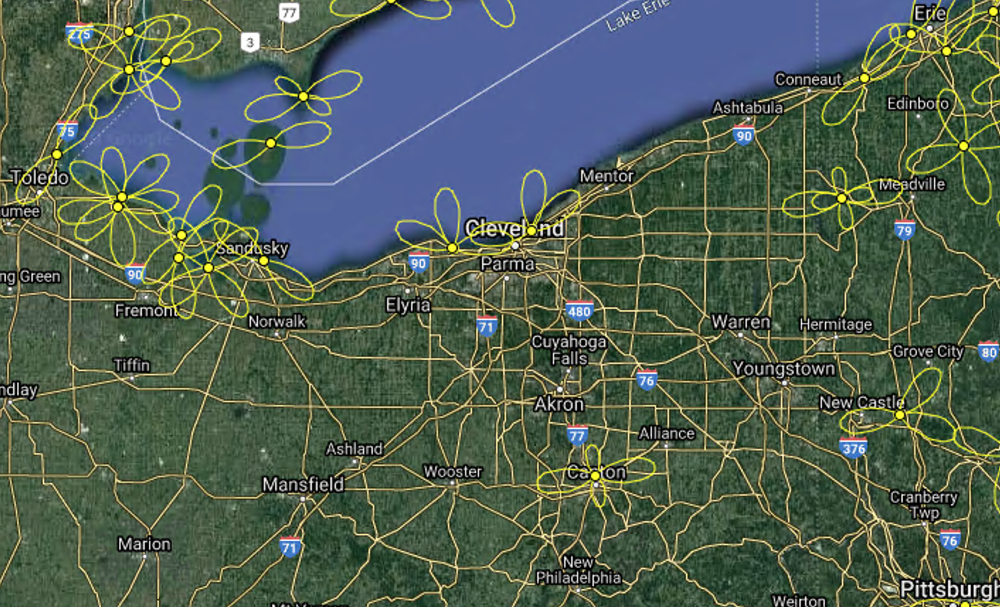

# White paper for developing interpretive material for local MOTUS network

## NEOH MOTUS network

Our local network began with a broad-based partnership focussed on reducing the effect of bird-building collisions on migratory bird populations. It has been estimated that as many as [one billion birds die in collisions with glass every year](https://abcbirds.org/program/glass-collisions/).  Many of these collisions occur as birds migrate at night, when they are attracted to buildings that are lit up.  

Every year during spring and fall migration, birds strike buildings at night in Cleveland.  Most of these birds die from their injuries.  Lights Out Cleveland was formed to reduce the numbers of bird-building collisions.  The group has enrolled 25 local building owners in a program to encourage them to turn their lights off at night during migration seasons.  The group has a large number of volunteers who have been collecting the birds that die for scientific research.  They take any injurred birds that are still alive to a local wildlife rehabilitation center.  Staff at the center have been successfully rehabilitating some of the birds.  They have also started collaborating with bird researchers to measure the success of their rehabilitation programs.

In order to track rehabilitated birds and to compare their movements to unaffected birds, team members have been putting radio transmitters on some of the rehabilitated birds to track their movements after they are released from the rehab facility.  For comparison, an uninjured bird of the same species is also tagged with a radio transmitter at a nearby bird banding station.  This work is coordinated by researchers at the Powdermill Nature Reserve.  They have also been providing the tags and tracking equipment.

To track the rehabilitated birds as they migrate, we need a massive network of radio receivers across the spanning North and South America. This is where the MOTUS tower tracking system comes in.

The image above shows The network in the Cleveland region.  You can see the area covered by two recievers maintained by Cleveland Metroparks in the middle of the image.  We hope to add two more recievers to this local network by November 2020.

These images show antennas and sensor computer for one of the MOTUS receiver at the Cleveland Lakefront Nature Preserve that Cleveland Metroparks maintains.  This reciever was funded by a grant from the Foley Fund in 2019.

## What is MOTUS.org

From the MOTUS website: "The Motus Wildlife Tracking System is a collaborative research network that uses 
coordinated automated radio telemetry arrays to study movements of small animals."

Details about MOTUS can be found here:  https://motus.org/

## Need for interpretive materials

Now that our local MOTUS network is running and plans for expansion are moving forward, we need to develop materials to explain the project to the public. We feel this involves developing signs and possibly interactive displays that focus on three things:

 * Bird migrations
 * Lights Out Cleveland
 * MOTUS network

### Possible interpretive components

* 4 color interpretive signs for placement at local MOTUS tower sites
  * $????
* Interactive display showing latest birds detected by out network
  * $????
* Museum exhibit with interactive elements
  * $????
* ????
  * $????

## Current partners

* [Lights Out Cleveland](https://ohiolightsout.org/cities/lights-out-cleveland/) is a collaboration between
  * [Cleveland Museum of Natural History](https://www.cmnh.org/)
    * Coordinates building lights out program
    * Conducts research on birds that die
    * Will maintain two future MOTUS receivers
  * [Lake Erie Nature & Science Center](https://www.lensc.org/)
    * Manages the bird rehabilitation program
* [Powdermill Nature Reserve](https://carnegiemnh.org/visit-powdermill/)
  * Conducts research on technology to reduce bird-building collisions
  * Conducts research on success of rehabilitated birds
* [Ohio Bird Conservation Network](https://obcinet.org/)
* [Cleveland Metroparks](https://clevelandmetroparks.com)
  * [Foley Fund?]()
  * Manages local two existing MOTUS receivers
